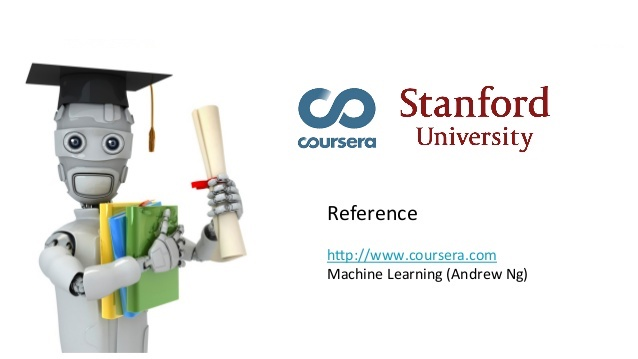

<h1>Machine Learning course</h1>
    <h5><b>Created by:</b>  Stanford University and Coursera</h5> 

---

:snake: **This repository contains *Python* implementations of the programming assignments for the [Machine Learning course](https://www.coursera.org/learn/machine-learning) taught by Andrew Ng (Stanford/Coursera).** :snake:

---

Despite being the most popular introductory machine learning course, its programming assignments are in MATLAB/OCTAVE (not so popular languages in data science). Due to the Python growing popularity, I decided to re-write all the programming assignments in Python.

All the assignments in this repository use [Jupyter Notebook](http://jupyter.org) because it allows me to create and share documents that have live code, equations (powered by LaTeX), visualizations and narrative text.

This repository contains Python implementations of certain exercises from the course by Andrew Ng.
Machine Learning (Coursera) assignments in Python

### Programming Assignments

- [x] [Week 2 - Linear Regression](https://github.com/matheus-asilva/Coursera-Machine-Learning-With-Python/blob/master/Week%201/exercise1.ipynb)
- [ ] Week 3 - Logistic Regression
- [ ] Week 4 - Multi-class Classification and Neural Networks
- [ ] Week 5 - Neural Networks Learning
- [ ] Week 6 - Regularized Linear Regression and Bias v.s. Variance
- [ ] Week 7 - Support Vector Machines
- [ ] Week 8 - K-means Clustering and Principal Component Analysis
- [ ] Week 9 - Anomaly Detection and Recommender Systems

#### About the Machine Learning course by Andrew Ng 

This course provides a broad introduction to machine learning, datamining, and statistical pattern recognition. 

Topics include: 
* Supervised learning (parametric/non-parametric algorithms, support vector machines, kernels, neural networks)
* Unsupervised learning (clustering, dimensionality reduction, recommender systems, deep learning). 
* Best practices in machine learning (bias/variance theory; innovation process in machine learning and AI). 

The course also draws from numerous case studies and applications, so that you'll also learn how to apply learning algorithms to building smart robots (perception, control), text understanding (web search, anti-spam), computer vision, medical informatics, audio, database mining, and other areas.
